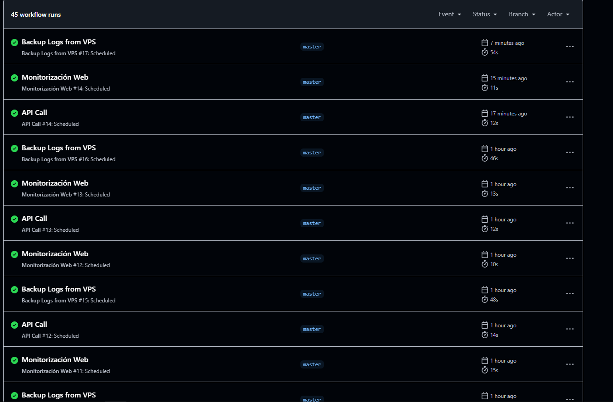
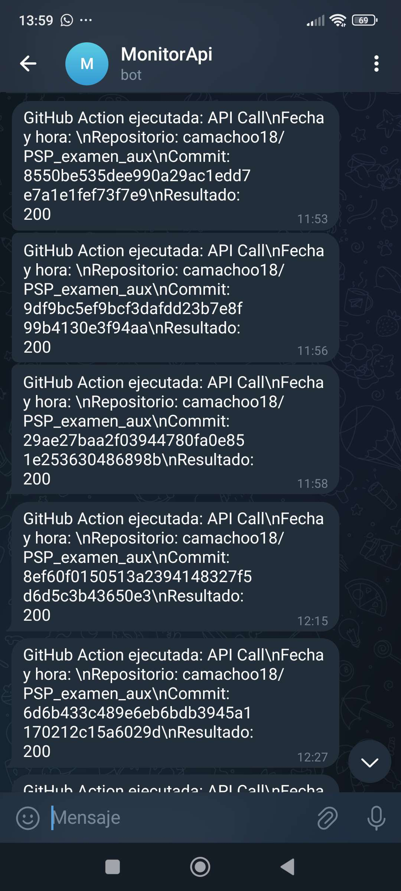

# Informe del Proyecto

Este proyecto contiene varios archivos y directorios que se utilizan para diferentes propósitos. A continuación se describe cómo se ha hecho cada cosa:

## Archivos Principales

- **api_call.yml**: Este archivo contiene la configuración para realizar llamadas a la API. Incluye detalles como la URL de la API, los parámetros de la solicitud y las cabeceras necesarias.

- **backup_logs.yml**: Este archivo se utiliza para configurar los backup de los registros. Define las rutas de los archivos de registro que deben ser respaldados y la ubicación de destino para dichos backup.

- **monitor_web.yml**: Este archivo contiene la configuración para monitorear un sitio web. Incluye detalles como la URL del sitio web, los intervalos de monitoreo y las condiciones de alerta.

- **status_codes.log**: Este archivo de registro almacena los códigos de estado de las respuestas de la API. Se utiliza para realizar un seguimiento de las respuestas exitosas y fallidas.

## Directorios

- **.github/workflows/**: Este directorio contiene los flujos de trabajo de GitHub Actions. Estos flujos de trabajo se utilizan para automatizar tareas como la integración continua, las pruebas y el despliegue ademas de tener los diferentes .yml para cada automatización de tareas previamente habladas.

- **api_responses/**: Este directorio almacena las respuestas de la API en formato JSON. Cada archivo JSON contiene la respuesta de una llamada a la API, con un nombre de archivo que incluye la fecha y la hora de la solicitud.

- **logs_backup/**: Este directorio contiene copias de seguridad de los archivos de registro. Los archivos de registro se almacenan aquí para garantizar que no se pierdan datos importantes en caso de un fallo del sistema.

## Como se usa:

Para realizar una llamada a la API, me aseguro de que el archivo `api_call.yml` esté configurado correctamente y ejecuta el script correspondiente. Las respuestas de la API se almacenarán en el directorio `api_responses/`.

Para realizar un backup de los registros, me aseguro de que el archivo `backup_logs.yml` esté configurado correctamente y ejecuta el script de copia de seguridad. Los archivos de registro se almacenarán en el directorio `logs_backup/`.

Para monitorear un sitio web, me aseguro de que el archivo `monitor_web.yml` esté configurado correctamente y ejecuta el script de monitoreo. Las alertas se generarán según las condiciones definidas en el archivo de configuración.

Ademas cada uno de ellos podemos manejarlo y que se vaya ejecutando automaticamente cada 5 minutos con CRON, comprobandolo en el apartado de `Actions` en github.

Aparte he añadido un bot de telegram que me avisara del estado de la api y su respuesta ante ella.

Pruebas:

